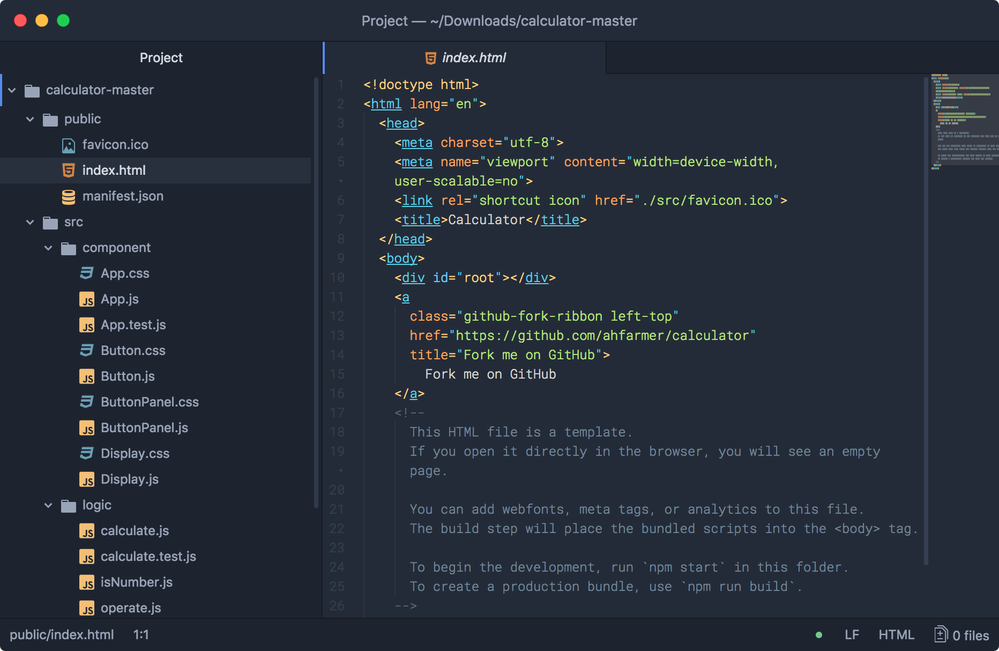
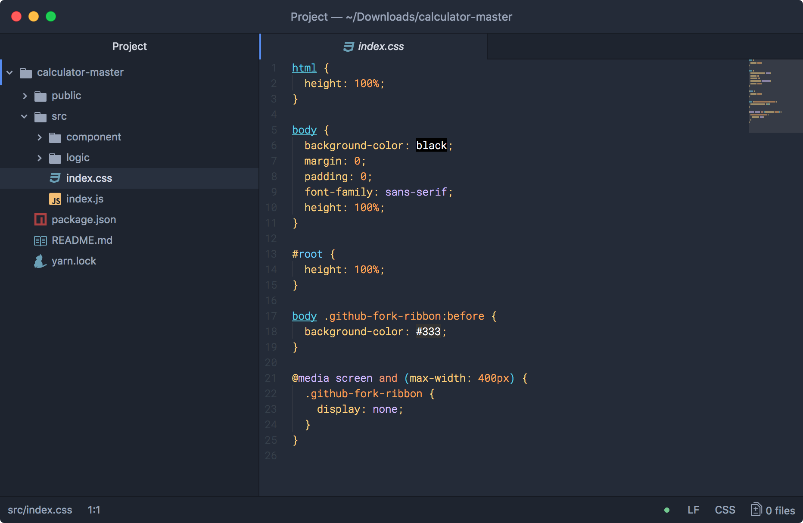
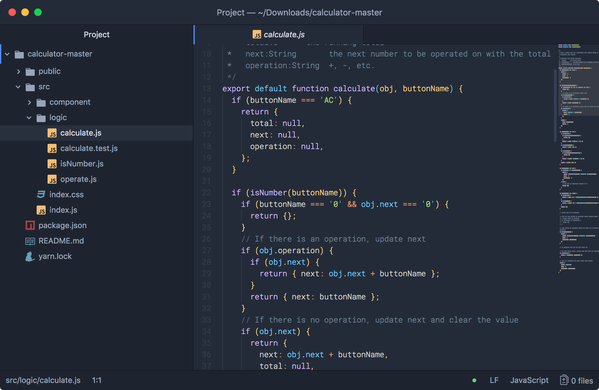
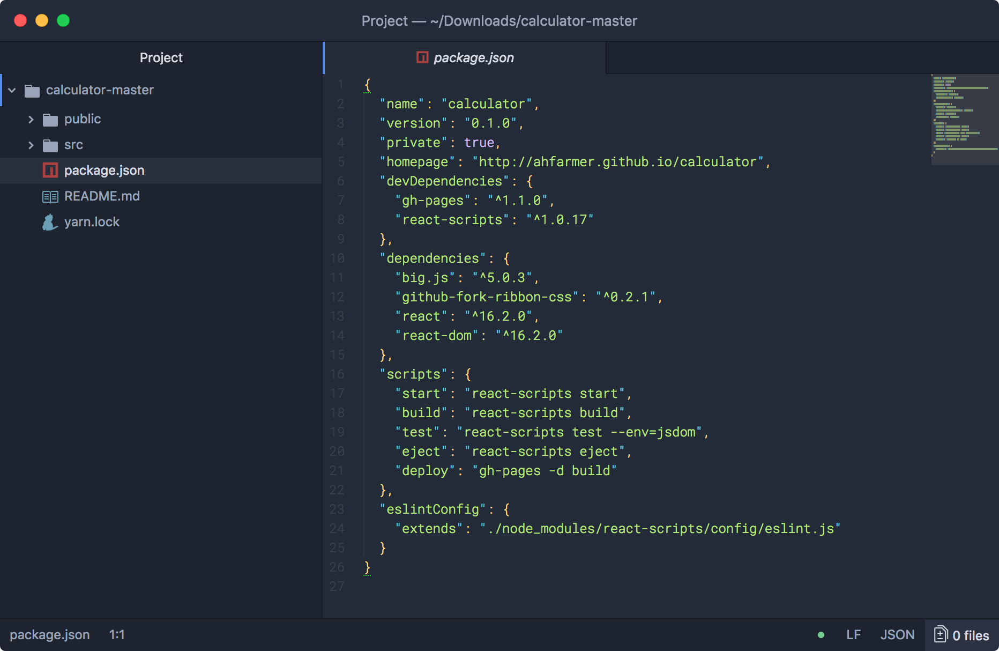

# Ayu Mirage(ish) Syntax Theme for ATOM
---
This theme is based on the Ayu Mirage(ish) Color Scheme by @dempfi - [Ayu](https://github.com/dempfi/ayu). I merely just selected these colors and made an Atom UI theme because I could not find one.

### Screenshots

<h6 align='center'>Ayu Mirage(ish)<code>html</code> files</h6>

---

<h6 align='center'>Ayu Mirage(ish) <code>css</code> files</h6>

---

<h6 align='center'>Ayu Mirage(ish) <code>js</code> files</h6>

---

<h6 align='center'>Ayu Mirage(ish) <code>json</code> files</h6>

## Install
Install the Ayu Mirage(ish) UI Theme via Atom by going to [Preferences/Settings > Install] and search for Ayu Mirage(ish) UI Theme (make sure you're searching under 'Themes'), or install through CLI

`$ apm install ayu-mirage-ish-syntax`

## UI Theme
The Ui theme used in the screenshots is [one-dark-ui](https://atom.io/themes/one-dark-ui)
